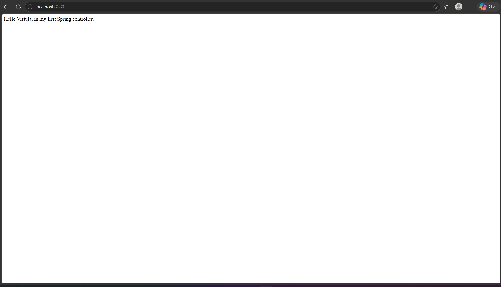
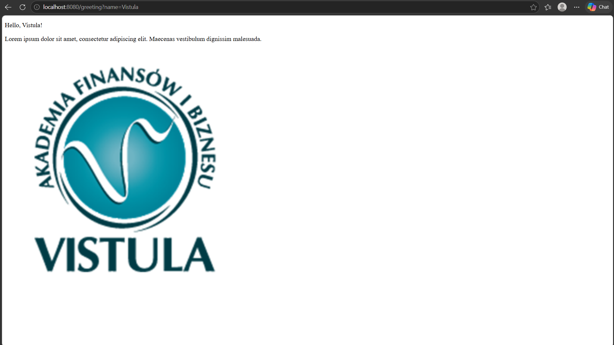

# Task 1 — First Spring Boot App

## Table of Contents

- [Description](#description)
- [Project Structure](#project-structure)
- [Dependencies](#dependencies)
- [How to Run](#how-to-run)
- [Endpoints](#endpoints)
- [Code Explanation](#code-explanation)

---

## Description

A basic Spring Boot web application using the MVC design pattern with Thymeleaf as the template engine. It demonstrates how to create a Spring controller, handle HTTP GET requests, return plain text responses and render HTML views with dynamic data.

---

## Project Structure

```
first-project-java-spring/
└── src/
    └── main/
        ├── java/
        │   └── pl/edu/vistula/firstprojectjavaspring/
        │       ├── controller/
        │       │   └── HelloController.java
        │       └── FirstProjectJavaSpringApplication.java
        └── resources/
            ├── static/
            │   └── images/
            │       └── vistula.png
            ├── templates/
            │   └── greeting.html
            └── application.properties
```

---

## Dependencies

- Spring Web
- Thymeleaf
- Lombok

---

## How to Run

1. Clone the repository
2. Open `first-project-java-spring` in IntelliJ IDEA
3. Right-click project → **Maven → Reload Project**
4. Run `FirstProjectJavaSpringApplication`
5. Open browser: `http://localhost:8080/`
6. Test greeting page: `http://localhost:8080/greeting?name=Vistula`

---

## Endpoints

### GET `/` — Hello Message

Returns a plain text string directly from the controller using `@RestController` behavior.

**Request:**
```
GET http://localhost:8080/
```

**Response:**
```
Hello Vistula, in my first Spring controller.
```

**Screenshot:**



---

### GET `/greeting?name=Vistula` — Greeting Page

Returns an HTML page rendered by Thymeleaf with a dynamic name parameter, lorem ipsum text and an image.

**Request:**
```
GET http://localhost:8080/greeting?name=Vistula
```

**Response:** Rendered HTML page showing:
- `Hello, Vistula!`
- Lorem ipsum paragraph
- Vistula university logo image

**Screenshot:**



---

## Code Explanation

### HelloController.java

```java
@Controller
public class HelloController {

    @GetMapping(value = "/")
    public String hello() {
        return "Hello Vistula, in my first Spring controller.";
    }

    @GetMapping("/greeting")
    public String greeting(
        @RequestParam(name = "name", required = false, defaultValue = "World") String name,
        Model model) {
        model.addAttribute("name", name);
        return "greeting";
    }
}
```

| Annotation / Code | Explanation |
|---|---|
| `@Controller` | Marks this class as a Spring MVC controller that returns views |
| `@GetMapping("/")` | Maps HTTP GET requests on the `/` path to the `hello()` method |
| `@GetMapping("/greeting")` | Maps HTTP GET requests on `/greeting` to the `greeting()` method |
| `@RequestParam` | Reads the `name` query parameter from the URL; defaults to `"World"` if not provided |
| `model.addAttribute("name", name)` | Passes the name value into the Thymeleaf template as a variable |
| `return "greeting"` | Tells Spring to render `templates/greeting.html` |

---

### greeting.html

```html
<!DOCTYPE HTML>
<html xmlns:th="http://www.thymeleaf.org">
<head>
    <title>Getting Started: Serving Web Content</title>
    <meta http-equiv="Content-Type" content="text/html; charset=UTF-8" />
</head>
<body>
    <p th:text="'Hello, ' + ${name} + '!'" />
    <p>
        Lorem ipsum dolor sit amet, consectetur adipiscing elit.
        Maecenas vestibulum dignissim malesuada.
    </p>
    
</body>
</html>
```

| Code | Explanation |
|---|---|
| `xmlns:th="http://www.thymeleaf.org"` | Enables Thymeleaf processing on this HTML file |
| `th:text="'Hello, ' + ${name} + '!'"` | Dynamically inserts the `name` variable passed from the controller |
| `th:src="@{/images/vistula.png}"` | Thymeleaf resolves the path to the image stored in `static/images/` |
